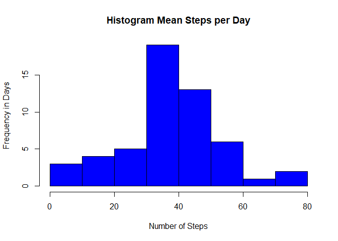
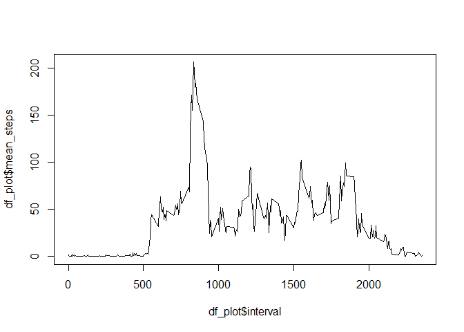
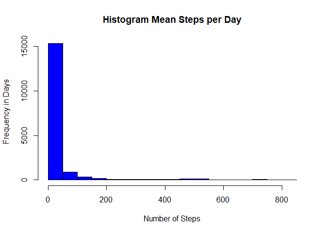
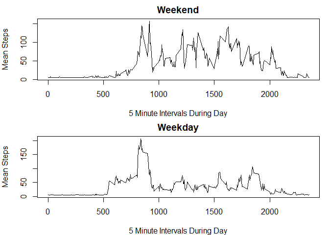

```r
## Loading and preprocessing the data
#install.packages("dplyr")
library("dplyr")
```

```
## 
## Attaching package: 'dplyr'
```

```
## The following objects are masked from 'package:stats':
## 
##     filter, lag
```

```
## The following objects are masked from 'package:base':
## 
##     intersect, setdiff, setequal, union
```

```r
df <- tbl_df(read.csv("activity.csv", header = TRUE))
```


```r
## What is mean total number of steps taken per day?

# data processing
mean_steps_day <- summarise(group_by(df, date), mean(steps))
colnames(mean_steps_day) <- c("date", "mean_steps")

# create histogram
hist(mean_steps_day$mean_steps, main = "Histogram Mean Steps per Day",
              xlab = "Number of Steps", ylab = "Frequency in Days", col = "blue")
```

<!-- -->

```r
summary(mean_steps_day$mean_steps)
```

```
##    Min. 1st Qu.  Median    Mean 3rd Qu.    Max.    NA's 
##  0.1424 30.6979 37.3785 37.3826 46.1597 73.5903       8
```


```r
## What is the average daily activity pattern?

# data processing
df_plot <- summarise(group_by(df, interval), mean(steps, na.rm = T))
colnames(df_plot) <- c("interval", "mean_steps")

# create plot
plot(df_plot$interval, df_plot$mean_steps, type = "l")
```

<!-- -->


```r
## Imputing missing values

# total number of rows containing NAs
sum(rowSums(is.na(df)))
```

```
## [1] 2304
```

```r
# impute mean per day for NAs
df$steps[is.na(df$steps)] <- mean(df$steps, na.rm = TRUE)

# create histogram
hist(df$steps, main = "Histogram Mean Steps per Day",
              xlab = "Number of Steps", ylab = "Frequency in Days", col = "blue")
```

<!-- -->

```r
# report mean and median
mean_steps_day_2 <- summarise(group_by(df, date), mean(steps))
summary(mean_steps_day_2)
```

```
##          date     mean(steps)     
##  2012-10-01: 1   Min.   : 0.1424  
##  2012-10-02: 1   1st Qu.:34.0938  
##  2012-10-03: 1   Median :37.3826  
##  2012-10-04: 1   Mean   :37.3826  
##  2012-10-05: 1   3rd Qu.:44.4826  
##  2012-10-06: 1   Max.   :73.5903  
##  (Other)   :55
```

```r
# impact
# The data looks skewed rather than normally distributed with NAs substituted by the daily mean
```


```r
## Are there differences in activity patterns between weekdays and weekends?


# data processing
df$date <- as.Date(df$date)
df$weekday <- weekdays(df$date)

# create a vector of weekdays
weekdays1 <- c('maandag', 'dinsdag', 'woensdag', 'donderdag', 'vrijdag')

# create a logical vector
df$weekday <- factor((weekdays(df$date) %in% weekdays1), 
         levels=c(FALSE, TRUE), labels=c('weekend', 'weekday'))

# impute mean per day for NAs
df$steps[is.na(df$steps)] <- mean(df$steps, na.rm = TRUE)


wkend <- subset(df,as.character(df$weekday)=="weekend")
wkday <- subset(df,as.character(df$weekday)=="weekday")

steps_wkend <- with(wkend,tapply(steps,interval,mean,na.rm=TRUE))
steps_wkday <- with(wkday,tapply(steps,interval,mean,na.rm=TRUE))

interval_wkend <- unique(wkend$interval)
interval_wkday <- unique(wkday$interval)

final_wkend <- data.frame(cbind(steps_wkend,interval_wkend))
final_wkday <- data.frame(cbind(steps_wkday,interval_wkday))

# People take more steps in the weekends

par(mfrow=c(2,1),mar=c(4,4,2,1))

plot(final_wkend$interval_wkend,final_wkend$steps_wkend,type = "l",xlab = "5 Minute Intervals During Day",
     ylab = "Mean Steps",main = "Weekend")
plot(final_wkday$interval_wkday,final_wkday$steps_wkday,type = "l",xlab = "5 Minute Intervals During Day",
     ylab = "Mean Steps",main = "Weekday")
```

<!-- -->

